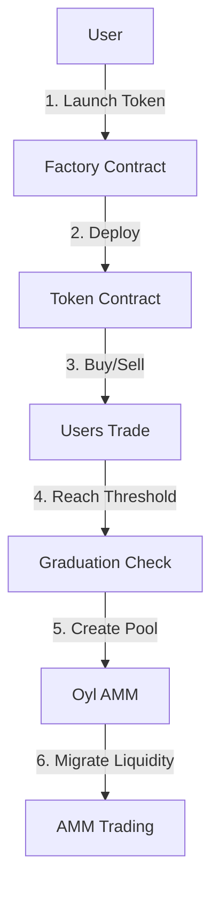

# Alkanes Bonding Curve System - Architecture

## Contract Architecture

The bonding curve system consists of three main components:

### 1. Factory Contract (309KB WASM)
**Repository**: github.com/missingpurpose/bonding-curve-factory
**Purpose**: Deploy and manage bonding curve tokens
**Features**:
- Token deployment and registry
- Spam prevention (max 100 tokens/creator)
- Platform fee collection (0.001 BTC per launch)
- Graduation tracking

### 2. Token Contract (323KB WASM)
**Repository**: github.com/missingpurpose/bonding-curve-alkanes
**Purpose**: Individual token with bonding curve mechanics
**Features**:
- Exponential pricing algorithm
- BUSD/frBTC base currency support
- Buy/sell operations
- AMM graduation logic

### 3. Oyl AMM Integration (External)
**Status**: Currently mocked, needs real SDK integration
**Features**:
- Pool creation during graduation
- Liquidity migration
- LP token distribution
- Advanced trading features

## Contract Interaction Flow



1. User calls Factory.createToken() with parameters
2. Factory deploys new Token contract instance
3. Users trade via bonding curve mechanics
4. Token reaches graduation threshold
5. Token creates Oyl AMM pool
6. Liquidity migrates to AMM

## Base Token Integration

### BUSD (Alkane ID: 2:56801)
- USD-pegged stablecoin
- Used for stable pricing
- Default base currency
- 8 decimal precision

### frBTC (Alkane ID: 32:0)
- Bitcoin-pegged token
- Alternative base currency
- 1:1 BTC backing
- Native Bitcoin integration

## Development Status

### Completed
- ✅ Token contract (323KB WASM)
  - Exponential pricing
  - BUSD/frBTC support
  - Graduation framework
  - Security patterns

- ✅ Factory contract (309KB WASM)
  - Token deployment
  - Registry management
  - Fee collection
  - Spam prevention

### In Progress
- 🚧 Unit tests for both contracts
- 🚧 Integration tests for factory→token→AMM flow
- 🚧 Real Oyl SDK integration

### Pending
- ⏳ Testnet deployment
- ⏳ Security audit
- ⏳ Frontend development

## Security Considerations

### Factory Contract
- Single initialization
- Owner-only pause function
- Creator token limits
- Fee validation

### Token Contract
- CEI pattern
- Overflow protection
- Reserve validation
- Slippage checks

### AMM Integration
- Atomic graduation
- LP token distribution
- Liquidity validation
- Rollback mechanisms

## Testing Requirements

### Unit Tests
- Factory contract functions
- Token contract operations
- Price calculations
- State management

### Integration Tests
- Factory → Token deployment
- Token → AMM graduation
- Multi-user scenarios
- Edge cases

### Security Tests
- Overflow conditions
- Access controls
- Economic attacks
- Network failures

## Deployment Strategy

1. **Local Testing**
   ```bash
   # Build both contracts
   cd bonding-curve-system
   cargo build --target wasm32-unknown-unknown --release
   cd ../bonding-curve-factory
   cargo build --target wasm32-unknown-unknown --release
   ```

2. **Testnet Deployment**
   ```bash
   # Deploy factory first
   alkanes deploy --wasm factory.wasm --network testnet \
     --init-params "owner_block=<block> owner_tx=<tx>"
   
   # Test token deployment
   alkanes deploy --wasm bonding_curve_system.wasm --network testnet \
     --init-params "name=Test symbol=TST base_price=4000..."
   ```

3. **Mainnet Launch**
   - Complete security audit
   - Deploy factory contract
   - Verify source code
   - Monitor initial launches

## Frontend Integration

The frontend will interact with both contracts:

1. **Factory Contract**
   - Token launch wizard
   - Deployed tokens list
   - Launch analytics

2. **Token Contract**
   - Trading interface
   - Price charts
   - Portfolio management
   - Graduation tracking

3. **AMM Integration**
   - Pool creation
   - Liquidity provision
   - Advanced trading

## Repository Structure

```
alkanes-bonding-curve/
├── bonding-curve-system/     # Token contract (323KB)
│   ├── src/
│   │   ├── lib.rs           # Main contract
│   │   ├── bonding_curve.rs # Pricing engine
│   │   └── amm_integration.rs # AMM framework
│   └── target/wasm32-unknown-unknown/release/
│       └── bonding_curve_system.wasm
│
└── bonding-curve-factory/    # Factory contract (309KB)
    ├── src/
    │   └── lib.rs           # Factory logic
    └── target/wasm32-unknown-unknown/release/
        └── bonding_curve_factory.wasm
```

## Next Steps

1. **Testing**
   - Add unit tests for both contracts
   - Test factory + token interaction
   - Test graduation flow

2. **Oyl Integration**
   - Replace mock AMM functions
   - Test pool creation
   - Verify graduation

3. **Frontend**
   - Token launch wizard
   - Trading interface
   - Analytics dashboard

## References

- [Alkanes Developer Disclaimer](https://alkanes.build/docs/developers/disclaimer)
- [Oyl AMM Documentation](https://docs.oyl.io/developer)
- [Factory Contract Repository](https://github.com/missingpurpose/bonding-curve-factory)
- [Token Contract Repository](https://github.com/missingpurpose/bonding-curve-alkanes)
