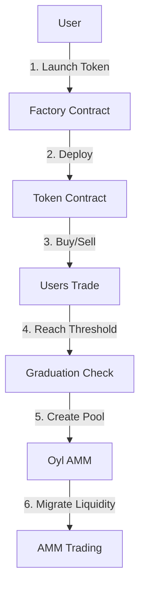

# Alkanes Bonding Curve System - Overview

## System Architecture

The bonding curve system consists of three main components:

1. **Factory Contract** (309KB WASM)
   - Deploys new token contracts
   - Tracks deployed tokens
   - Manages platform fees
   - Prevents spam (100 tokens/creator limit)
   - Repository: github.com/missingpurpose/bonding-curve-factory

2. **Token Contract** (323KB WASM)
   - Individual token with bonding curve
   - BUSD/frBTC base currency support
   - Exponential pricing algorithm
   - AMM graduation logic
   - Repository: github.com/missingpurpose/bonding-curve-alkanes

3. **Oyl AMM Integration**
   - External AMM protocol
   - Pool creation during graduation
   - LP token distribution
   - Advanced trading features

## Contract Interaction Flow



1. User calls Factory.createToken() with parameters
2. Factory deploys new Token contract instance
3. Users trade via bonding curve mechanics
4. Token reaches graduation threshold
5. Token creates Oyl AMM pool
6. Liquidity migrates to AMM

## Token Contract Opcodes

| Code | Function | Description |
|------|----------|-------------|
| 0 | `initialize` | Set token parameters |
| 1 | `buy_tokens` | Purchase tokens |
| 2 | `sell_tokens` | Sell tokens |
| 3 | `get_buy_quote` | Get buy price |
| 4 | `get_sell_quote` | Get sell price |
| 5 | `graduate` | Migrate to AMM |
| 6 | `get_curve_state` | Get token info |
| 99-104 | View functions | Get token data |

## Factory Contract Opcodes

| Code | Function | Description |
|------|----------|-------------|
| 0 | `initialize` | Set factory owner |
| 1 | `create_token` | Deploy new token |
| 2 | `notify_graduation` | Update AMM status |
| 10 | `get_total_tokens` | Count tokens |
| 11 | `get_token_by_index` | Get token info |
| 20 | `set_paused` | Emergency pause |

## Base Token Integration

### BUSD (Alkane ID: 2:56801)
- USD-pegged stablecoin
- Used for stable pricing
- Default base currency
- 8 decimal precision

### frBTC (Alkane ID: 32:0)
- Bitcoin-pegged token
- Alternative base currency
- 1:1 BTC backing
- Native Bitcoin integration

## Development Status

### Completed
- ✅ Token contract (323KB WASM)
  - Exponential pricing
  - BUSD/frBTC support
  - Graduation framework
  - Security patterns
  - Unit tests

- ✅ Factory contract (309KB WASM)
  - Token deployment
  - Registry management
  - Fee collection
  - Spam prevention

### In Progress
- 🚧 AMM Integration
  - Replace mock functions
  - Test pool creation
  - Verify graduation

### Pending
- ⏳ Security Audit
  - Review state changes
  - Check arithmetic
  - Test economic scenarios

- ⏳ Testnet Deployment
  - Deploy contracts
  - Test interactions
  - Monitor performance

## Frontend Integration

The frontend will interact with both contracts:

1. **Factory Contract**
   - Token launch wizard
   - Deployed tokens list
   - Launch analytics

2. **Token Contract**
   - Trading interface
   - Price charts
   - Portfolio management
   - Graduation tracking

3. **AMM Integration**
   - Pool creation
   - Liquidity provision
   - Advanced trading

## Repository Structure

```
alkanes-bonding-curve/
├── bonding-curve-system/     # Token contract (323KB)
│   ├── src/
│   │   ├── lib.rs           # Main contract
│   │   ├── bonding_curve.rs # Pricing engine
│   │   └── amm_integration.rs # AMM framework
│   └── target/wasm32-unknown-unknown/release/
│       └── bonding_curve_system.wasm
│
└── bonding-curve-factory/    # Factory contract (309KB)
    ├── src/
    │   └── lib.rs           # Factory logic
    └── target/wasm32-unknown-unknown/release/
        └── bonding_curve_factory.wasm
```

## Next Steps

1. **AMM Integration**
   - Study Oyl SDK documentation
   - Replace mock functions
   - Test with BUSD/frBTC
   - Verify graduation flow

2. **Security Audit**
   - Review state changes
   - Check arithmetic
   - Verify access controls
   - Test economic scenarios

3. **Testnet Deployment**
   - Deploy contracts
   - Test interactions
   - Monitor performance

## References

- [Alkanes Developer Docs](https://alkanes.build/docs/developers/disclaimer)
- [Oyl AMM Documentation](https://docs.oyl.io/developer)
- [Factory Contract Guide](FACTORY_CONTRACT_GUIDE.md)
- [Technical Documentation](TECHNICAL_DOCS.md)
- [Deployment Guide](DEPLOYMENT_GUIDE.md)
